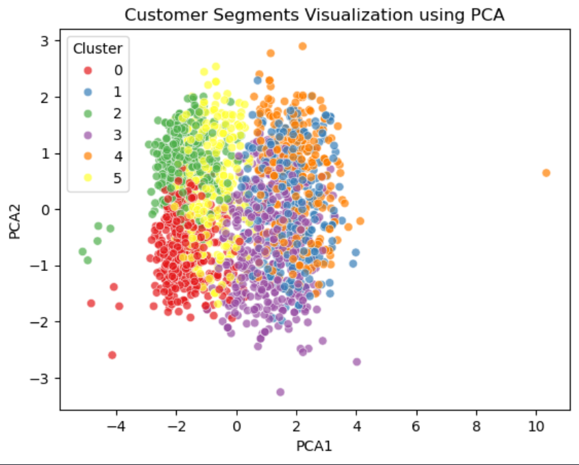
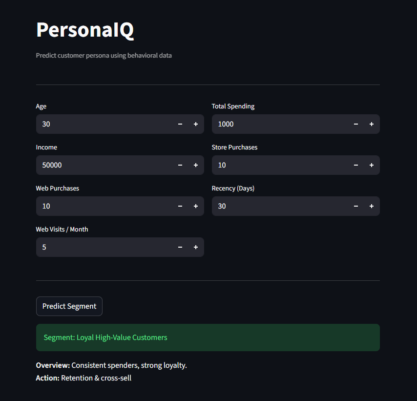

# 🧠 PersonaIQ  
### Customer Persona Discovery using Unsupervised Machine Learning


🔹 **Business Use Case:** Marketing Optimization & Personalization  
🔹 **ML Focus:** Dimensionality Reduction + Clustering  
🔹 **Deployment:** Real-time Web Application  

---

## 🚀 Why This Project Matters
Marketing teams often overspend by targeting customers uniformly.  
PersonaIQ enables **data-driven customer differentiation**, allowing businesses to tailor marketing strategies based on actual behavioral patterns.

---

## 🔍 What This Project Does
✔ Segments customers into distinct personas  
✔ Improves cluster quality using PCA  
✔ Converts ML output into actionable business insights  
✔ Provides real-time persona prediction via web app  

---

## 🧠 Machine Learning Pipeline
- Feature Engineering on customer behavior (spend, recency, channels)
- PCA for dimensionality reduction and noise removal
- K-Means clustering for persona discovery
- Business interpretation of clusters
- Deployment-ready inference pipeline

---

## 🛠️ Tech Stack
**Python | Pandas | NumPy | Matplotlib | Seaborn | Scikit-learn | PCA | K-Means | Streamlit**

---

## 📊 Customer Persona Clusters



This visualization shows customer personas formed after applying PCA and K-Means.  
Each cluster represents a distinct behavioral segment based on spending, recency, and engagement patterns.

---

## 🚀 Streamlit Application



An interactive web application that allows users to input customer attributes and receive real-time persona predictions using the trained clustering model.

---

## 🗝️ Key Takeaways
- Demonstrates end-to-end customer segmentation using unsupervised machine learning
- Converts clustering outputs into business-interpretable customer personas
- Showcases production readiness through a deployed Streamlit application
- Emphasizes practical marketing and personalization use cases

---

## ▶️ Run the Project Locally

```bash
# Clone the repository
git clone <repository-url>

# Navigate to the project directory
cd <project-directory>

# Install required dependencies
pip install -r requirements.txt

# Launch the Streamlit application
streamlit run app.py

```
---

## 📌 Conclusion
**PersonaIQ** demonstrates how unsupervised learning can be translated into actionable business insights and deployed as a real-world data product.
